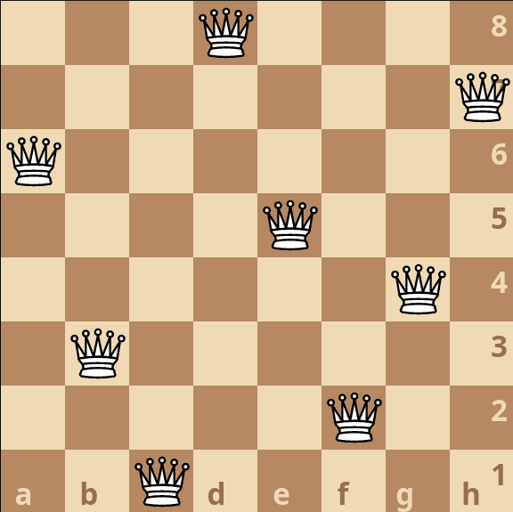
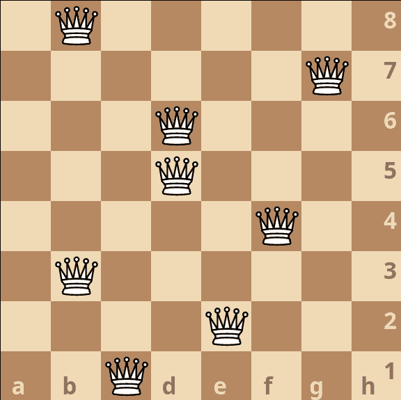

# queens
Implementation of a genetic algorithm to solve n-queens puzzles.

## What?
The n-queens puzzle is fairly straightforward. Given an n*n chess board, place n queens such that no queen is able to capture another. This means that each queen must be placed on a unique horizontal, vertical, and diagonal line.

| 8-queens solution | 8-queens non-solution |
| - | - |
|  |  |

## Usage
If you just want to see what a solution would look like without any hassle you can run this project on the [Rust Playground](https://play.rust-lang.org/?version=stable&mode=release&edition=2021&gist=dd1e60282b53c3bb54011c8154280b81). It likely will not be updated if this project is changed. Change `N_TO_SOLVE` to your liking and hit run. (Due to Rust Playground limitations on execution time, large `n`s will likely time out.)

If you're running locally, clone the repo and run `cargo run --release`. Requires a standard Rust toolchain to be installed.

## Optimization Opportunities/TODO
- Replace `count_intersects()` with a function that just says whether one board is better than another. Counting past the point where you know that is pointless.

- Tune population size.

- Multithreading?

- Reduce `clone()` operations when possible.

## Thanks
Adam Salam for introducing me to this puzzle and the basic approach for solving it
with a genetic algorithm. You can take a look at his solver [here](https://github.com/AdamSalamDev/N-Queens_Web).

Alejandro Rico for his [great article](https://aljrico.github.io/blog/genetic-algorithms/) on this problem.
